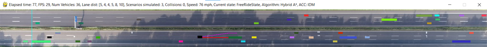
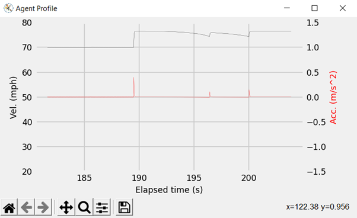
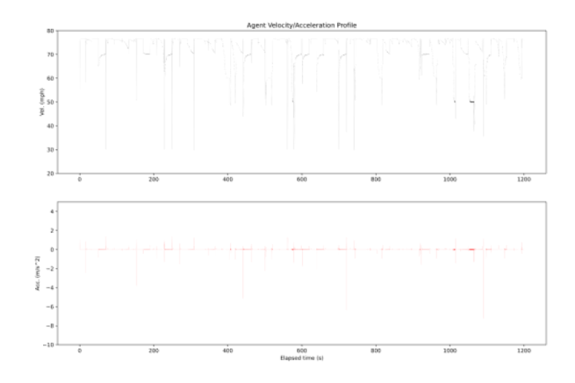

# Autonomous Highway Driving Using Finite State Machine and Hybrid A* Path Planning

This project simulates the driving behaviour of an autonomous car on a 3-lane highway.
The user can choose between Normal or Hybrid A* path planners and PID or IDM for adaptive cruise control.
Traffic is generated randomly, but the simulations can be made repeatable by providing a **seed** in *cfg.py*.

## Running the simulation:

The following files must be in the same directory to run the simulation:

- test.py
- highway.jpg
- cfg.py
- highway_drive.py
- highway_states.py
- state.py
- Hybrid_Astar_algorithm.py
- Astar_algorithm.py
- traffic.py
- agent.py
- timer.py

The simulation is executed by running *test.py*.

## Usage:
Running the simulation opens two windows:

##### Pygame window:

This shows a top view of a straight highway section.

The pygame window caption displays realtime information about the current state of the simulation. From left-right these are:
- Elapsed time: The amount of time (in seconds) that has passed since the start of the simulation
- FPS: The current frame rate of the program
- Num Vehicles: The number of vehicles currently in the window (excl. agent vehicle)
- Lane Dist: The number of vehicles in each lane from top to bottom (excl. agent vehicle)
- Scenarios Simulated: The number of times the position of the agent vehicle has been reset.
- Collisions: The number of times the agent vehicle has collided with another car.
- Speed: The current speed of the agent vehicle in mph.
- Current State: The current state of the Finite State Machine.
- Algorithm: The search algorithm being used by the agent (toggle with **SPACEBAR**).
- ACC: The cruise control method being used by the agent (toggle with **k** key).

Vehicles are displayed as rectangles with the ego vehicle coloured black, and the traffic in randomly selected colours.

The agent vehicle follows the path calculated by the normal or hybrid A* planner. This is drawn in cyan/purple for the normal/hybrid planners, respectively.
The user can toggle between path planners by pressing the SPACEBAR.

The agent vehicle mimics a radar system to detect surrounding vehicles. Red lines on the screen indicate if a vehicle is being tracked.

The turquoise vertical line on the left of the screen indicates the spawn area for traffic. Collisions occurring before this line are not counted.

##### Matplotlib figure window:
Plots the velocity and acceleration traces of the agent vehicle in real time.

## Ending the simulation:
The simulation finishes when the elapsed time reaches the total simulation time defined in cfg.py.
However, the current simulation data will still be saved if the user closes the pygame window early.

#### When the simulation finishes:
The elapsed time, number of collisions, successes and scenarios simulated are printed to the console.
A file called *AgentProfile.png* is generated which contains a graph of the complete velocity and acceleration profiles of the agent vehicle for the duration of the simulation.
NB: Re-running the simulation overwrites AgentProfile.png so user should change the file name if they wish to keep the data.

## Visuals:
Pygame window: 

Live figure:

Agent Profile:

## Customisation:
The *cfg.py* file contains a number of parameters which can be adjusted to customise the behaviour of the simulation.
Some examples are listed below:
- window_width: Assign a value in pixels to set the width of the pygame window. Defaults to the width of the screen. NB. this does not scale the simulation, but rather lengthens or shortens the highway
- FPS: Sets the maximum frame rate used by the simulation. Good performance achieved for values >20, but see warning ->NB. The program uses a fixed timestep and will slow down if the frame rate drops. Significant fluctuations in FPS will distort the vel/acc profile
- time_gain: Adjusts the speed at which vehicles move across the screen. Reduce this to run at higher FPS before encountering lag.
- traffic_density: The number of vehicle spawns per second. Values <5 recommended. Each spawn adds up to 3 vehicles to the simulation.
- hybrid: Sets the hybrid A* algorithm as default on start.
- IDM: Sets IDM control as default on start.
- seed: Set this to an integer to get reproducible behaviour from the simulation
